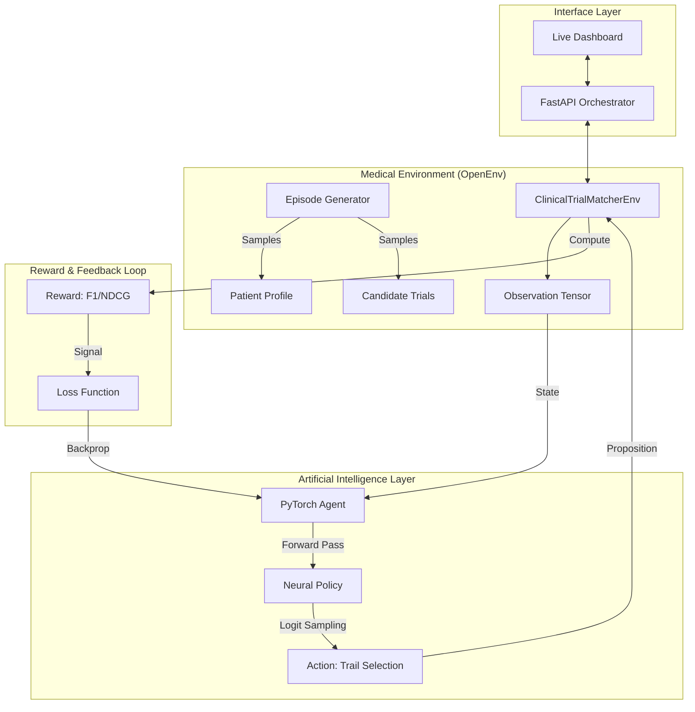

# 🧬 Clinical Trial Matcher: Reinforcement Learning for Healthcare

[](https://pytorch.org/)
[](https://github.com/facebookresearch/openenv)
[](https://fastapi.tiangolo.com/)
[](https://www.docker.com/)

> **An advanced, OpenEnv-compliant Reinforcement Learning environment for intelligent patient-to-clinical-trial matching.**

---

## 📖 Table of Contents
- [Project Overview](#-project-overview)
- [The Problem: The Patient Recruitment Crisis](#-the-problem-the-patient-recruitment-crisis)
- [System Architecture](#-system-architecture)
- [Reinforcement Learning Framework](#-reinforcement-learning-framework)
- [Technical Implementation: PyTorch REINFORCE](#-technical-implementation-pytorch-reinforce)
- [Interactive Dashboard](#-interactive-dashboard)
- [Getting Started](#-getting-started)
- [Project Roadmap](#-project-roadmap)

---

## 🔬 Project Overview
**Clinical Trial Matcher** is a high-performance Reinforcement Learning system designed to optimize the matching of patients with suitable clinical trials. By leveraging the **Meta PyTorch OpenEnv** interface, this platform facilitates the training of intelligent agents that can parse medical logic, adhere to complex eligibility criteria, and identify life-saving treatments with surgical precision.

---

## ⚡ The Problem: The Patient Recruitment Crisis
A staggering **80% of clinical trials** fail to meet their recruitment timelines. The underlying reason is a "Data Bottleneck":
- **Exponential Complexity**: Trials have hundreds of diverse inclusion/exclusion rules (Biomarkers, Age, History).
- **Manual Overhead**: Doctors manually reading 50+ page protocols for every patient is unscalable.
- **High Friction**: Mis-matched enrollments lead to trial failures and lost lives.

**Our Solution** uses AI to bridge this gap, treating medical eligibility as a **Markov Decision Process (MDP)** where a PyTorch agent learns to maximize matching rewards over thousands of simulated patient journeys.

---

## 🏗 System Architecture

We adhere to a decoupled, scalable architecture that separates environment physics from agent logic.



---

## 🎯 Reinforcement Learning Framework

### 1. The Observation Space (State)
The environment emits a multifaceted observation tensor:
- **Patient Phenotypes**: Age, City, Gender, Disease (Type 2 Diabetes, Breast Cancer, etc.).
- **Biological Sensors**: Specific Biomarkers (Genetic markers, blood pressure, etc.).
- **Protocol Library**: A set of 8 candidate clinical trials with hidden ground-truth criteria.

### 2. The Task Suite
- **Easy**: Basic rule-based eligibility.
- **Medium**: Biomarker-specific medical constraints.
- **Hard**: Optimization task requiring hierarchical ranking (NDCG) across logistics and medical optimality.

---

## 🤖 Technical Implementation: PyTorch REINFORCE

Our system implements a mathematically true **Policy Gradient (REINFORCE)** algorithm running on the FastAPI backend.

- **Neural Policy Network**: A Multi-Layer Perceptron (MLP) consisting of custom linear layers and ReLU activations.
- **Optimization Strategy**: We utilize `Adam` for adaptive learning rate optimization, minimizing a custom loss derived from the negative log-likelihood of successful trial selections scaled by the environment's reward.
- **Convergence Verification**: The system includes "Early Stopping." Training only concludes when the agent demonstrates a three-episode "success streak" where normalized rewards remain above 0.95.
- **Model Persistence**: Trained weights are automatically serialized into `clinical_trial_model_weights.pt` upon convergence, allowing for production-ready inference.

---

## 📊 Interactive Dashboard

The project features a **Live RL Visualizer** built with Vanilla HTML5/CSS3 and Chart.js:
- **Real-time Reward Plotting**: View the learning curve as it converges.
- **Episodic Log Terminal**: Watch the agent's internal medical decision-making process.
- **Policy Progress Tracer**: Visually identifies if the agent is in an Exploration (guessing) or Exploitation (mastery) phase.

---

## 🚀 Getting Started

### Local Setup
1. **Clone & Install**
   ```bash
   pip install -r server/requirements.txt
   ```
2. **Launch Server**
   ```bash
   uvicorn server.app:app --host 0.0.0.0 --port 7860 --reload
   ```
3. **Train & Match**
   Access the dashboard at `http://localhost:7860`.

### Docker Deployment
```bash
docker build -t clinical-trial-matcher .
docker run -p 7860:7860 clinical-trial-matcher
```

---

## 🛣 Project Roadmap
- [ ] **Transformer-based Encoders**: Implementing Attention mechanisms for even more complex biomarker relationships.
- [ ] **Multi-Agent Systems**: Allowing multiple specialists to negotiate trial assignments.
- [ ] **FHIR Compatibility**: Direct integration with existing Electronic Health Record (EHR) standards.

---

## 📜 Development Notes
Detailed research documentation, architecture comparisons, and development logs are available in the [docs/research/](docs/research/) directory.

---

**Developed for the Meta PyTorch Hackathon.** 🏥 + 🤖 = 🚀
